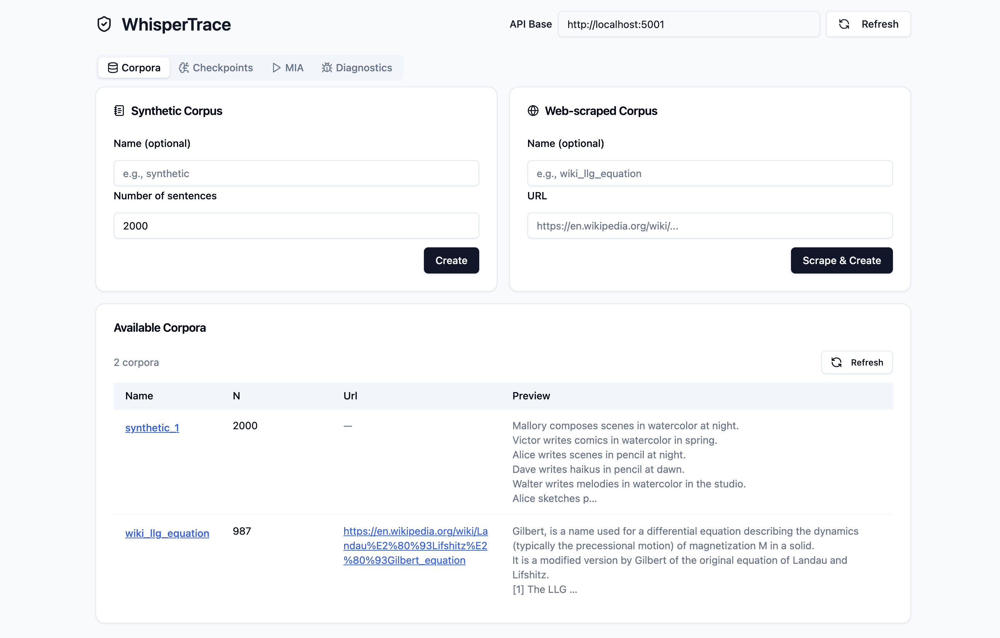

# WhisperTrace

A simple **membership inference attack (MIA)** POC on a word-level LSTM language model trained on synthetic or web-scraped corpora. It demonstrates how an attacker can determine whether a specific sentence was part of the training data used to train a language model - an operation relevant to the IP protection of text data.



In short, the attack works by comparing the loss distributions of training vs held-out sentences. If the distributions are sufficiently different, a threshold can be found to distinguish between training and held-out sentences with a good degree of accuracy (measured by ROC-AUC). In other words, if a sentence has a low loss, it is likely to be from the training set, while if it has a high loss, it is likely to be from the held-out set.

Project includes a Flask API and a React frontend for easy interaction with the attack functionalities, as well as Docker deployment scripts. Using aforementioned scripts, the API can be easily deployed in Docker containers without any additional configuration or need to install dependencies.

## Project Structure

```
📁 whispertrace
├── 📁 whispertrace-api          # WhisperTrace Flask API
│   ├── 📁 resource              # Pre-trained models and synthetic corpora
│   │   ├── 📁 checkpoints       # Trained models' checkpoints
│   │   ├── 📁 corpora           # This is where synthetic and scraped corpora are stored
│   │   └── 📁 mias              # Attack results (plots, scores), organized by timestamps
│   └── 📁 src                   # Source code
│       ├── 📁 api               # API endpoints implementation
│       ├── 📁 common            # Common functions and variables
│       ├── 📁 dataset           # Dataset functions
│       ├── 📁 domain            # Domain models
│       ├── 📁 lm                # Language model functions
│       ├── 📁 schema            # Schemas used throughout the application
│       ├── 📁 service           # Services
│       ├── 📁 util              # Utility functions
│       ├── 📁 vocab             # Vocabulary functions
│       ├── Pipfile              # Python dependencies
│       └── logger_config.yaml   # Logger configuration
├── 📁 whispertrace-frontend     # WhisperTrace React frontend
│   └── 📁 src                   # Source code
│       ├── 📁 assets            # Static assets (images, fonts, etc.)
│       ├── 📁 components        # React components
│       ├── 📁 lib               # Library functions
│       ├── App.tsx              # Main App component
│       ├── App.css              # Main App CSS styles
│       ├── main.tsx             # Vite application entry point
│       ├── index.css            # Global CSS styles
│       └── vite-env.d.ts        # Vite environment variables
├── 📁 whispertrace-deployment   # WhisperTrace deployment scripts
│   └── 📁 docker                # Docker configuration
│       ├── 📁 compose           # Docker Compose files and relevant .env files
│       ├── 📁 image             # Docker images
│       ├── deploy.bat           # Windows deployment script
│       ├── deploy.ps1           # PowerShell deployment script
│       └── deploy.sh            # GNU/Linux and MacOS deployment script
├── README.md
├── LICENSE
└── .gitignore
```

## Deployment

In order to deploy WhisperTrace services, make sure you have [Docker](https://www.docker.com/get-started) and [Docker Compose](https://docs.docker.com/compose/install/) installed on your machine. Once those dependencies are satisfied, follow the steps below:

1. Add `.env` file in the `whispertrace-deployment/docker/compose` folder with relevant environment variables. This is an example of the `.env` file:

    ```env
    # Description: Environment variables for docker-compose

    WHISPERTRACE_API_PORT=5001
    WHISPERTRACE_FRONTEND_PORT=5002
    ```
2. Navigate to `whispertrace-deployment/docker` folder.
3. Use the utility script `deploy.sh` to deploy the services (Note: In all examples below, GNU/Linux and MacOS version of the script is used, however, there are Windows versions available as well. Please do note that Windows versions of the script are not tested as extensively as the GNU/Linux and MacOS version):

    ```bash
    ./deploy.sh up
    ```

That's it! Command above will build and run all relevant services in Docker containers. The following services will be deployed:

* **WhisperTrace API** - API service for interacting with WhisperTrace functionalities:
    + Available at **http://localhost:5001** (default value).
    + API documentation available at:
        - Swagger: **http://localhost:5001/docs/whispertrace**
        - Redoc: **http://localhost:5001/redoc**
    + Logs available at `whispertrace-api/src/whispertrace.log`.
    + Source code and resources (corpora, checkpoints, attack results) are mounted as Docker volumes, so any changes made to the source code or resources will be reflected in the running containers and vice-versa. Since we're using development Flask server, any changes made to the source code will automatically restart the server.
* **WhisperTrace Frontend** - A simple React-based frontend for interacting with the WhisperTrace API:
    + Available at **http://localhost:5002** (default value).
    + Source code is mounted as a Docker volume, so any changes made to the source code will be reflected in the running container and vice-versa. Since we're using Vite development server, any changes made to the source code will automatically reload the frontend.

### Stop Services

To stop all services, use the following command:

```bash
./deploy.sh down
```

### Deployment Options

In order to change default behavior of `deploy.sh`, use the following options:

* `-b` or `--build`: Explicitly build all relevant containers. Default is `false`.
* `-e` or `--environment`: Default is `local`. Other environments (`dev`, `stage`, `prod` etc. are yet to be supported).

For example, in order to deploy services in the development environment and force building of all relevant containers, use the following command:

```bash
./deploy.sh up -b -e dev
```

Full list of options can be found by running:

```bash
./deploy.sh --help
```

## Dependencies

### WhisperTrace API

In order to run WhisperTrace API locally (without Docker), make sure you have the following dependencies installed (included `Pipfile` will take care of installing the relevant Python packages):

* [**Python 3.11:**](https://www.python.org/downloads/release/python-3110/) A high level programming language.
* [**Pipenv:**](https://pipenv.pypa.io/en/latest/) Python dependency management tool.
* [**Flask:**](https://pypi.org/project/Flask/) - Web framework.
* [**flask-smorest:**](https://pypi.org/project/Flask-Smorest/) - Flask extension for building RESTful APIs.
* [**flask-cors:**](https://github.com/corydolphin/flask-cors) - A Flask extension adding a decorator for Cross Origin Resource Sharing (CORS) support
* [**dynaconf:**](https://pypi.org/project/dynaconf/) - Configuration management.
* [**Requests:**](https://docs.python-requests.org/en/latest/) HTTP library for Python.
* [**BeautifulSoup4:**](https://www.crummy.com/software/BeautifulSoup/bs4/doc/) Library for parsing HTML and XML documents.
* [**PyTorch:**](https://pytorch.org/) An open source machine learning framework.
* [**scikit-learn:**](https://scikit-learn.org/stable/) Machine learning library.
* [**NumPy:**](https://numpy.org/) Fundamental package for scientific computing with Python.
* [**Pandas:**](https://pandas.pydata.org/) Data manipulation and analysis library.

### WhisperTrace Frontend

In order to run WhisperTrace frontend locally (without Docker), make sure you have the following dependencies installed (included `package.json` will take care of installing the relevant Node packages):

* [**Node.js (v18 or later):**](https://nodejs.org/en/download/) JavaScript runtime built on Chrome's V8 JavaScript engine.
* [**npm (v8 or later):**](https://docs.npmjs.com/downloading-and-installing-node-js-and-npm) Node package manager.
* [**Vite:**](https://vitejs.dev/) Next generation frontend tooling.
* [**React:**](https://reactjs.org/) A JavaScript library for building user interfaces.
* [**TypeScript:**](https://www.typescriptlang.org/) A strongly typed programming language that builds on JavaScript.
* [**Axios:**](https://axios-http.com/) Promise based HTTP client for the browser and node.js.
* [**tailwindcss:**](https://tailwindcss.com/) A utility-first CSS framework for rapid UI development.
* [**postcss:**](https://postcss.org/) A tool for transforming CSS with JavaScript plugins.
* [**shadcn/ui:**](https://ui.shadcn.com/) A collection of beautiful, accessible components built with Radix UI and Tailwind CSS.
* [**autoprefixer:**](https://github.com/postcss/autoprefixer) A PostCSS plugin to parse CSS and add vendor prefixes using values from "Can I Use".

## Usage

### WhisperTrace API

If you wish to use API only, you can interact with the WhisperTrace API using tools like [Postman](https://www.postman.com/) or [curl](https://curl.se/). If more convenient, you can also use the interactive API documentation available at `http://localhost:5001/docs/whispertrace` (Swagger) or `http://localhost:5001/redoc` (Redoc).

Typical workflow would involve the following steps:

1. **Generate Corpus:** Use corpus creation endpoints (`/corpora`) to create either a synthetic or web-scraped corpus for training the language model. You can specify parameters like number of sentences in a corpus or URL that should be scraped for content.
2. **Train Language Model:** Use the training endpoint (`/checkpoints`) to train a word-level LSTM language model on the generated corpus. You can specify hyperparameters like number of epochs, batch size, learning rate, etc.
3. **Perform Membership Inference Attack:** Use the attack endpoint (`/mia`) to perform the membership inference attack on the trained language model. You can specify parameters like checkpoint and corpus to use, as well as batch size and custom input (if input is not provided, pre-configured examples will be used).

### WhisperTrace Frontend

Once the services are deployed, you can access the WhisperTrace frontend at `http://localhost:5002`. The frontend provides a simple interface for interacting with the WhisperTrace API. You can perform all the steps mentioned in the API usage section through the frontend interface.